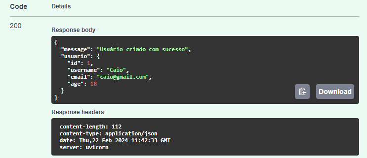

## Segundo Passo!

### A partir do momento que executamos a aplicação, teremos acesso ao localhost, e acessando esse localhost passando um /docs como endpoint ex:

### E com isso nós temos acesso ao Swagger UI!
### O Swagger UI é uma interface de usuário que facilita a visualização e interação com APIs RESTful

### Nele nós podemos ver e testar todos os métodos que criamos em nossa aplicação

### vamos para o teste do primeiro método!
### Ao expandir o método você deve clicar na opção 'try it out'
### Aqui você pode inserir os dados do usuário que esta criando!

### Ao clicar em 'Execute', podemos rolar a página um pouco para baixo e ver a resposta que recebemos no campo 'Response Body'
### Ele nos mostra a mensagem que programamos, um código 200 de sucesso e nos retorna o usuário que foi criado!

### A partir daqui, todos os métodos serão testados usando ele!

### Siga para o passo 3 e daremos continuidade a nossa API!

##### * lembre-se que a cada mudança no código será necessário cadastrar um usuário novo,
#####   pois como estamos utilizando um dicionário ele acaba perdendo o registro com o reload do codigo